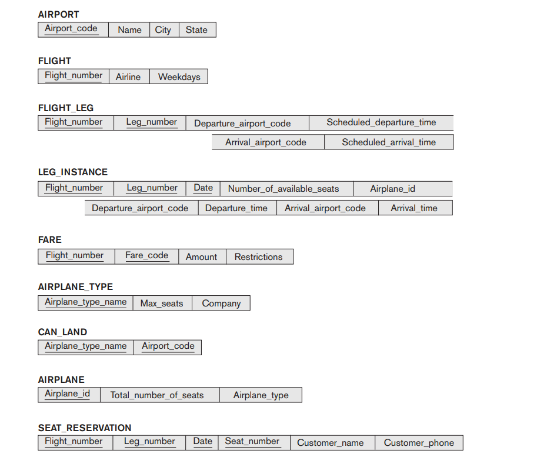

*******************************************************
*  **Author    :**  Matthew Joel       
*  **Email     :**  matthewjoel77@live.com             
*******************************************************

# Airline SQL Implementation
The following is an excercise from the textbook *FUNDAMENTALS OF Database Systems SEVENTH EDITION* by Ramez Elmasri and Shamkant B. Navathe.

* *Consider the AIRLINE relational database schema shown in Figure 5.8,
which describes a database for airline flight information. Each FLIGHT is
identified by a Flight_number, and consists of one or more FLIGHT_LEGs
with Leg_numbers 1, 2, 3, and so on. Each FLIGHT_LEG has scheduled
arrival and departure times, airports, and one or more LEG_INSTANCEs—
one for each Date on which the flight travels. FAREs are kept for each
FLIGHT. For each FLIGHT_LEG instance, SEAT_RESERVATIONs are kept, as
are the AIRPLANE used on the leg and the actual arrival and departure times
and airports. An AIRPLANE is identified by an Airplane_id and is of a particular AIRPLANE_TYPE. CAN_LAND relates AIRPLANE_TYPEs to the AIRPORTs
at which they can land. An AIRPORT is identified by an Airport_code. Consider an update for the AIRLINE database to enter a reservation on a particular flight or flight leg on a given date.*

* We will translate the following Relational Model into SQL code.
## Files:
1) Airline.SQL - An SQL file containing all the neccessary code to create an implementation of the AIRLINE schema mentioned above.