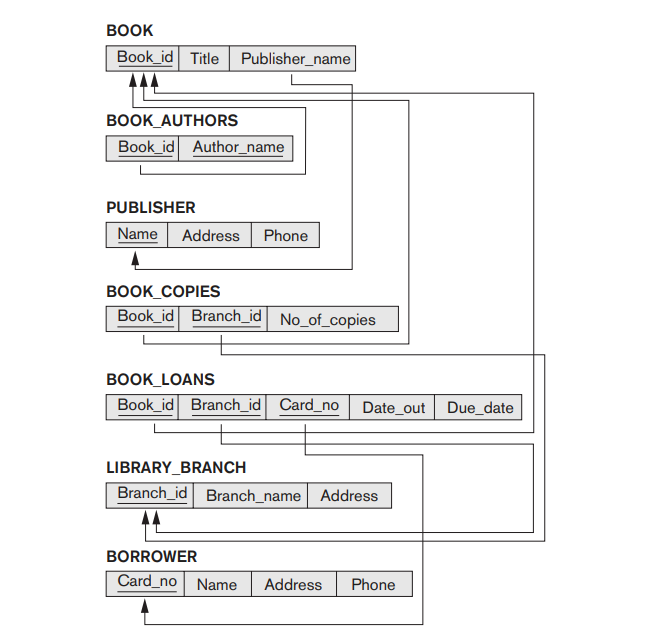

*******************************************************
*  **Author    :**  Matthew Joel       
*  **Email     :**  matthewjoel77@live.com             
*******************************************************

# Library SQL Implementation
The following is an excercise from the textbook *FUNDAMENTALS OF Database Systems SEVENTH EDITION* by Ramez Elmasri and Shamkant B. Navathe.

* Consider the given Relational Model

* We will translate the following Relational Model into SQL code.
## Files:
1) Library.SQL - An SQL file containing all the neccessary code to create an implementation of the LIBRARY schema mentioned above.