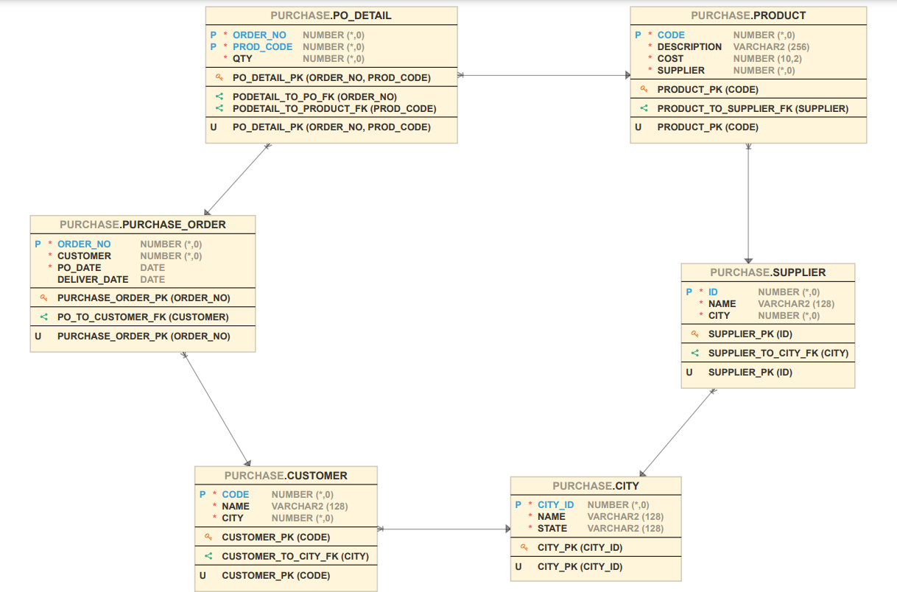

*******************************************************
*  **Author    :**  Matthew Joel       
*  **Email     :**  matthewjoel77@live.com             
*******************************************************

# Sample SQL Queries
Consider the following schema

Write queries to do the following:

1. Select all the cities that are customers and suppliers located in it.
2. Select all the cities with customers located in them but no suppliers there.
3. Select the purchase order number for those that have only product code 330.
4. Select all the data of the purchase orders that include “Big Screen TV” or “PlayStation 4”
but not both.
5. Count how many customers are in the database.
6. List the products' max, min, and mean prices.
7. List for each city (name) how many customers live there.
8. List the daily purchase orders between April 1st , 2018, and April 20th , 2018.
9. List the cities with more than three clients.
10. List the number of purchase orders and the total amount placed per day.
11. List the purchase order number for all purchase orders that include a product with a price
equal to the max product price.
12. List the purchase order number for all orders where the quantity of an item is over 100
and all the items in that order have a requested amount of at least 30.
13. List the customer's name for those who ordered all the products in the database.
14. List the customer's name for those that had ordered all the products of suppliers located
in Denver.
15. List the product's description for those ordered by all the customers.
16. Display the customer data for those with the most purchase orders.
17. Select the customer's name for those who ordered the most different products.
18. Select the purchase order numbers for orders with the most products from different
suppliers. If a purchase order has three different products, but the same supplier provides
all three, then you will count that purchase order as having one product for this query.
19. Select the purchase order numbers with more than one product.
20. Select the purchase order numbers with products of more than one supplier.

## Files:
1) Queries.SQL - An SQL file containing all the neccessary queries mentioned above.